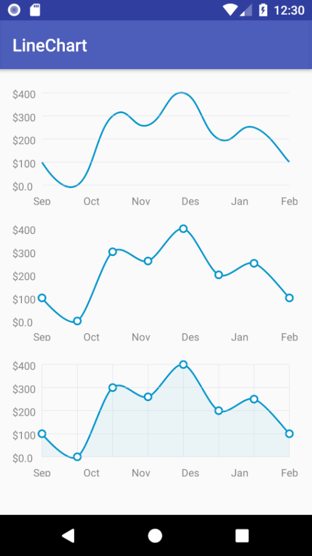

# simple-line-chart
This is an example of a simple linear chart with implementation like custom view.

## Usage
```xml
<com.djekgrif.linechart.LineChartView
        android:id="@+id/line_chart"
        android:layout_width="match_parent"
        android:layout_height="140dp"/>
```


